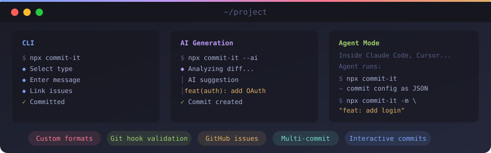

<p align="center">
  
</p>

# commit-it

Standardized git commits with AI message generation, interactive prompts, validation, and GitHub integration. Works as a CLI, inside AI agents, and as a programmable TypeScript API.

```bash
npx commit-it --ai    # AI writes the commit message for you
npx commit-it         # or use the interactive flow
```

## Why commit-it?

- **AI-powered commits** — Claude, Codex, OpenCode, or Cursor Agent generates messages from your diff. No API keys to manage.
- **Works inside AI agents** — Claude Code, Cursor, OpenCode, Aider, and Cline auto-detect and use your project's commit schema. Zero config.
- **Interactive when you want it** — guided flow for type, scope, message, issues, and co-authors.
- **Your format, your rules** — custom templates, custom types, regex-based rules. Use conventional commits, gitmoji, JIRA-prefixed, or invent your own.
- **Validates every commit** — enforces max length, required scopes, custom regex rules, and more.
- **GitHub-native** — search and link issues, create branches from issues, suggest scopes from PR labels.
- **Fully programmable** — every feature is importable as a TypeScript API for scripts, CI, and custom tools.

## Install

```bash
npm install -g commit-it     # global
npx commit-it                # or run without installing
bunx commit-it               # bun users
```

Also available as `cit` and `commit`:

```bash
cit --ai                     # AI commit
commit -t fix -m "resolve bug"  # non-interactive
```

## Quick Start

```bash
# Stage your changes + let AI write the message
commit-it --ai --all

# Or go interactive
commit-it --all
```

The `--all` (`-a`) flag stages all changes before committing, so you can skip `git add` entirely.

That's it. No config needed — commit-it uses sensible defaults (conventional commits, validation on, GitHub on).

### Optional setup

```bash
commit-it init           # generate a config file
commit-it setup-alias    # type "commit" instead of "commit-it"
commit-it install-hook   # validate every git commit automatically
```

## Custom Formats

Don't like conventional commits or gitmoji? Define your own format. commit-it's template engine, custom types, and regex rules let you enforce any commit style your team uses.

### Custom template

Override the commit message shape with `{{placeholders}}` and `{{#conditional}}` sections:

```typescript
export default defineConfig({
  // Bracket-style scopes: "fix[auth]: token refresh"
  template: '{{type}}{{#scope}}[{{scope}}]{{/scope}}: {{message}}',
})
```

```typescript
export default defineConfig({
  // Ticket-prefix style: "[PROJ-123] add login page"
  template: '[{{type}}] {{message}}',
})
```

Available placeholders: `{{type}}`, `{{scope}}`, `{{message}}`, `{{breaking}}`. Wrap any placeholder in `{{#field}}...{{/field}}` to only render that section when the field has a value.

### Custom types

Replace the default `feat`/`fix`/`docs` types with whatever vocabulary fits your team:

```typescript
export default defineConfig({
  validation: {
    allowedTypes: ['add', 'change', 'remove', 'fix', 'security', 'deploy'],
  },
})
```

### Custom format rules

Enforce any commit format with regex-based rules — Angular-style, JIRA-prefixed, uppercase categories, or anything else:

```typescript
export default defineConfig({
  validation: {
    customRules: [
      {
        name: 'require-ticket',
        pattern: '[A-Z]+-\\d+',
        message: 'Must include ticket (e.g., PROJ-123)',
        level: 'error',
        invert: false,    // fail when pattern DOESN'T match
      },
    ],
  },
})
```

See [Configuration](#configuration) for the full reference and [Example Configurations](#example-configurations) for complete setups.

## AI Commit Messages

commit-it shells out to whichever AI CLI you have installed. No API keys needed.

| Provider | CLI | Auto-detected |
|----------|-----|:---:|
| Claude Code | `claude` | Yes |
| OpenAI Codex | `codex` | Yes |
| OpenCode | `opencode` | Yes |
| Cursor Agent | `agent` | Yes |
| Custom | any CLI | Configurable |

```bash
# Stage changes, then generate
commit-it --ai

# Use a specific provider
commit-it --ai --provider codex

# Stage everything + AI + no prompts (perfect for scripts)
commit-it -a --ai -y

# Split staged changes into multiple logical commits
commit-it --all --multi
```

The AI analyzes your staged diff and returns a structured suggestion (type, scope, message, body). You can accept, edit in `$EDITOR`, or decline and go manual.

### First-run setup

On first use, a quick wizard helps you pick a provider, model, and commit style. Or create `~/.commit-it/config.json`:

```json
{
  "ai": { "auto": true, "provider": "claude" },
  "preset": "conventional",
  "editor": "code --wait"
}
```

Set `ai.auto` to `true` to always generate AI suggestions without the `--ai` flag.

## Agent Mode

When running inside an AI agent (Claude Code, Cursor, OpenCode, Aider, Cline, or any non-TTY environment), commit-it adapts automatically:

1. **No flags** — outputs the project's commit schema as JSON so the agent can generate a conforming message
2. **`-m` with a message** — auto-parses type and scope, validates, and commits directly
3. **AI generation is skipped** — the calling agent already has context

```bash
# Agent discovers the schema
$ commit-it
# → outputs JSON: { preset, template, types, scopes, validation, usage }

# Agent commits using the schema
commit-it -m "feat(cli): add agent detection"
```

Detection triggers: `stdin` is not a TTY, or env vars like `CLAUDE_CODE`, `CURSOR_AGENT`, `CODEX_CLI`, `OPENCODE`, `AIDER`, `CLINE` are set.

## Interactive Flow

Running `commit-it` walks through:

```
1. Select type        ─── feat, fix, docs, refactor, etc.
2. Select scope       ─── suggested from changed files + PR labels
3. Breaking change?   ─── adds ! and BREAKING CHANGE footer
4. Reference issues   ─── search GitHub issues, pick Closes/Fixes/Ref
5. Commit message     ─── short description (pre-filled from AI)
6. Body               ─── optional detailed description
7. Co-authors         ─── from config, GitHub, or manual entry
8. Preview & confirm  ─── see full message, validate, commit
```

Smart defaults at every step: AI suggestions > previous commit > PR labels > config.

## GitHub Integration

Requires the [GitHub CLI](https://cli.github.com/) (`gh`). All features degrade gracefully if `gh` isn't installed.

- **PR context** — detects current PR, suggests commit type from labels (`bug` -> `fix`, `feature` -> `feat`)
- **Scope from labels** — labels matching `scopeLabelPatterns` become scope suggestions
- **Issue linking** — search and link multiple issues per commit with different actions
- **Branch creation** — `commit-it branch` creates branches from issue titles
- **Co-author discovery** — fetches repo collaborators for co-author selection

### Issue references

You can reference multiple GitHub issues in a single commit. During the interactive flow, you'll be prompted to search for issues and choose how each one is referenced. After adding an issue, you're asked if you want to add another — repeat as many times as needed.

Each issue reference uses one of four actions:

| Action | Effect |
|--------|--------|
| `Closes` | Auto-closes the issue when the commit is merged |
| `Fixes` | Auto-closes the issue when the commit is merged |
| `Resolves` | Auto-closes the issue when the commit is merged |
| `Ref` | Mentions the issue without closing it |

References are appended as a footer in the commit message:

```
feat(auth): add OAuth support

Closes #42
Ref #99
Fixes #101
```

Use `Ref` when you want to link related context (e.g., a tracking issue or design doc) without auto-closing anything.

**In agent mode**, the schema output includes `validation.requireIssue` so agents know whether issue references are expected. Since there's no `--issue` CLI flag, agents include GitHub keywords directly in the commit message:

```bash
commit-it -m "feat(auth): add OAuth support" --body "Closes #42
Ref #99"
```

GitHub recognizes `Closes`, `Fixes`, `Resolves`, and `Ref` keywords anywhere in the commit message body or footer.

To require an issue reference on every commit, set `validation.requireIssue`:

```typescript
export default defineConfig({
  validation: {
    requireIssue: true,
  },
})
```

**Programmatic usage:**

```typescript
await directCommit({
  type: 'feat',
  message: 'add OAuth support',
  issueRefs: [
    { action: 'Closes', number: 42 },
    { action: 'Ref', number: 99 },
    { action: 'Fixes', number: 101 },
  ],
})
```

## Non-Interactive Mode

Skip all prompts by passing a message:

```bash
# Full conventional commit string (type auto-parsed)
commit-it -m "feat(auth): add OAuth support"

# Explicit type + message
commit-it -t fix -s auth -m "resolve token refresh"

# With body, breaking change, co-author
commit-it -t feat -m "redesign API" --body "Complete rewrite for v2" --breaking -c alice

# Dry run
commit-it -t refactor -m "extract validation" --dry-run
```

## Configuration

Works without config. When you need control, create `commit.config.ts`:

```typescript
import { defineConfig } from 'commit-it'

export default defineConfig({
  preset: 'conventional',        // or 'gitmoji'
  scopeMode: 'single',           // 'multi-inline' | 'multi-body'
  scopeMap: {
    'src/cli/**': 'cli',
    'src/services/**': 'core',
    'tests/**': 'test',
    '*.md': 'docs',
  },
  coauthors: {
    alice: 'Alice Smith <alice@example.com>',
    bob: 'Bob Jones <bob@example.com>',
  },
  github: {
    enabled: true,
    scopeLabelPatterns: ['scope:', 'area:'],
    auto: { detectIssues: true, suggestReviewers: false },
  },
  validation: {
    enabled: true,
    maxHeaderLength: 72,
    requireScope: false,
    requireBody: false,
    noTrailingPeriod: true,
    customRules: [
      {
        name: 'no-wip',
        pattern: '\\bWIP\\b',
        message: 'WIP commits not allowed',
        level: 'error',
        invert: true,
      },
    ],
  },
})
```

Also supports `.commitrc`, `.commitrc.json`, `.commitrc.yaml`, `package.json` `"commit"` key, and more via [c12](https://github.com/unjs/c12).

<details>
<summary><strong>Full config reference</strong></summary>

| Option | Type | Default | Description |
|--------|------|---------|-------------|
| `preset` | `'conventional' \| 'gitmoji'` | `'conventional'` | Commit format preset |
| `template` | `string` | from preset | Custom message template with `{type}`, `{scope}`, `{message}` |
| `scopeMode` | `'single' \| 'multi-inline' \| 'multi-body'` | `'single'` | How multiple scopes appear |
| `defaults.scope` | `string` | `''` | Pre-selected scope |
| `defaults.includeBody` | `boolean` | `true` | Default for "Add body?" prompt |
| `scopeMap` | `Record<glob, scope>` | `{}` | Map file patterns to scope names |
| `coauthors` | `Record<alias, 'Name <email>'>` | `{}` | Co-author aliases |
| `github.enabled` | `boolean` | `true` | Enable GitHub integration |
| `github.scopeLabelPatterns` | `string[]` | `['scope:', 'area:', 'component:']` | Label prefixes for scope extraction |
| `github.auto.detectIssues` | `boolean` | `true` | Default to "yes" for issue prompt |
| `github.auto.suggestReviewers` | `boolean` | `false` | Suggest reviewers from collaborators |
| `validation.enabled` | `boolean` | `true` | Enable validation |
| `validation.maxHeaderLength` | `number` | `72` | Max first-line length |
| `validation.maxBodyLineLength` | `number` | `100` | Max body line length (warning) |
| `validation.requireScope` | `boolean` | `false` | Scope is mandatory |
| `validation.requireBody` | `boolean` | `false` | Body is mandatory |
| `validation.requireIssue` | `boolean` | `false` | Issue reference required |
| `validation.allowedTypes` | `string[]` | from preset | Restrict to these types |
| `validation.allowedScopes` | `string[]` | any | Restrict to these scopes |
| `validation.noTrailingPeriod` | `boolean` | `true` | Subject must not end with `.` |
| `validation.noLeadingCapital` | `boolean` | `false` | Subject must start lowercase |
| `validation.customRules` | `CustomRule[]` | `[]` | Regex-based custom rules |

</details>

## Commands

| Command | Description |
|---------|-------------|
| `commit-it` | Create a commit (default) |
| `commit-it branch` | Create a branch from GitHub issues |
| `commit-it validate -m "..."` | Validate a commit message |
| `commit-it init` | Generate a config file |
| `commit-it install-hook` | Install commit-msg git hook |
| `commit-it uninstall-hook` | Remove the git hook |
| `commit-it presets` | List available presets |
| `commit-it config` | Print resolved config as JSON |
| `commit-it setup` | Run the setup wizard |
| `commit-it setup-alias` | Add a shell alias |

### Commit flags

| Flag | Alias | Description |
|------|-------|-------------|
| `--type <type>` | `-t` | Commit type (feat, fix, etc.) |
| `--message <msg>` | `-m` | Commit message or full conventional string |
| `--scope <scope>` | `-s` | Commit scope |
| `--body <text>` | | Commit body |
| `--all` | `-a` | Stage all changes before committing |
| `--amend` | | Amend the last commit |
| `--breaking` | `-b` | Mark as breaking change |
| `--ai` | | Generate message from staged diff |
| `--no-ai` | | Disable AI even if auto-enabled |
| `--provider <name>` | | AI provider (claude, codex, opencode, agent, custom) |
| `--multi` | | Split changes into multiple commits |
| `--verbose` | | Show AI commands being run |
| `--yes` | `-y` | Skip all prompts (headless mode) |
| `--co-author <value>` | `-c` | Add co-author by alias or `"Name <email>"` |
| `--no-github` | | Skip GitHub API calls |
| `--dry-run` | | Preview without committing |
| `--` | | Pass flags to `git commit` (e.g. `-- --no-verify`) |

## Validation

Built-in rules, all configurable:

| Rule | Default | Description |
|------|---------|-------------|
| Header max length | 72 | First line length limit |
| Conventional format | on | Must follow `type(scope): subject` |
| Blank line after header | on | Second line must be blank |
| Body max line length | 100 | Body line length (warning) |
| Scope required | off | Make scope mandatory |
| Body required | off | Make body mandatory |
| Issue required | off | Require issue reference |
| No trailing period | on | Subject can't end with `.` |
| No leading capital | off | Subject must start lowercase |

### Custom rules

```typescript
validation: {
  customRules: [
    {
      name: 'require-ticket',
      pattern: 'PROJ-\\d+',
      message: 'Must include a JIRA ticket (e.g., PROJ-123)',
      level: 'error',
      invert: false,    // fail when pattern DOESN'T match
    },
    {
      name: 'no-wip',
      pattern: '\\bWIP\\b',
      message: 'WIP commits not allowed',
      level: 'error',
      invert: true,     // fail when pattern DOES match
    },
  ],
}
```

## Presets

### Conventional Commits (default)

Format: `type(scope): message`

Types: `feat`, `fix`, `docs`, `style`, `refactor`, `perf`, `test`, `chore`

### Gitmoji

Format: `emoji message`

Types: `✨` (feature), `🐛` (fix), `📚` (docs), `💅` (style), `♻️` (refactor), `⚡` (perf), `✅` (test), `🔧` (chore), `🚀` (deploy)

## Programmatic API

Every feature is importable:

```bash
npm install commit-it
```

```typescript
import {
  directCommit,
  interactiveCommit,
  validateCommitMessage,
  parseCommitMessage,
  generateCommitMessage,
  getProjectSchema,
  isAgentEnvironment,
  isAIAvailable,
  defineConfig,
  loadConfig,
  getPreset,
  GitService,
  GitHubService,
  FormatValidator,
  renderTemplate,
  buildFullMessage,
} from 'commit-it'
```

<details>
<summary><strong>Direct commit</strong></summary>

```typescript
const result = await directCommit({
  type: 'feat',
  message: 'add user authentication',
  scope: 'api',
  body: 'Implements OAuth with Google and GitHub providers',
  breaking: true,
  breakingDescription: 'All endpoints now require Bearer token',
  issueRefs: [{ action: 'Closes', number: 42 }],
  coAuthor: 'alice',
  stageAll: true,
  dryRun: false,
})

console.log(result.hash)    // commit SHA
console.log(result.message) // full formatted message
```

</details>

<details>
<summary><strong>Interactive commit</strong></summary>

```typescript
const result = await interactiveCommit({
  preset: 'conventional',
  useAI: true,
  provider: 'claude',
  stageAll: true,
  headless: false,
  extraArgs: ['--signoff'],
})
```

</details>

<details>
<summary><strong>Validate and parse</strong></summary>

```typescript
// Validate
const result = validateCommitMessage('feat(cli): add command', {
  maxHeaderLength: 72,
  requireScope: true,
  allowedTypes: ['feat', 'fix', 'docs'],
})
console.log(result.valid)   // true
console.log(result.errors)  // []

// Parse
const parsed = parseCommitMessage('feat(api)!: redesign endpoints\n\nBody text\n\nCloses #42')
// { type: 'feat', scope: 'api', subject: 'redesign endpoints',
//   body: 'Body text', isBreaking: true, issues: [42] }
```

</details>

<details>
<summary><strong>Git and GitHub operations</strong></summary>

```typescript
const git = new GitService()
await git.getBranchName()      // "feature/new-api"
await git.getStatus()          // { staged: [...], unstaged: [...] }
await git.getStagedDiff()      // diff string
await git.getLastCommit()      // parsed commit object

const github = new GitHubService()
await github.searchIssues('login bug')   // [{ number, title, labels }]
await github.getCurrentPR()              // { number, title, labels }
await github.detectContext()             // full branch context
```

</details>

<details>
<summary><strong>AI generation</strong></summary>

```typescript
if (await isAIAvailable()) {
  const suggestion = await generateCommitMessage(diff, {
    branchName: 'feature/new-api',
    existingTypes: ['feat', 'fix', 'docs'],
  })
  // { type: 'feat', scope: 'api', message: '...', body: '...' }
}
```

</details>

<details>
<summary><strong>All exported types</strong></summary>

```typescript
import type {
  Config,
  CustomRule,
  ValidationConfig,
  DirectCommitOptions,
  InteractiveOptions,
  AICommitSuggestion,
  CoAuthor,
  CommitData,
  CommitType,
  Preset,
  CommitOptions,
  CommitResult,
  IssueReference,
  ParsedCommit,
  CommitContext,
  ScopeSuggestion,
  TemplateData,
  ParsedMessage,
  ValidationIssue,
  ValidationResult,
  FormatValidationResult,
} from 'commit-it'
```

</details>

## Example Configurations

<details>
<summary><strong>Monorepo</strong></summary>

```typescript
export default defineConfig({
  preset: 'conventional',
  scopeMap: {
    'packages/core/**': 'core',
    'packages/cli/**': 'cli',
    'packages/web/**': 'web',
    'packages/api/**': 'api',
  },
  validation: {
    requireScope: true,
    allowedScopes: ['core', 'cli', 'web', 'api', 'docs', 'deps'],
  },
})
```

</details>

<details>
<summary><strong>Enterprise / JIRA</strong></summary>

```typescript
export default defineConfig({
  preset: 'conventional',
  github: { enabled: false },
  validation: {
    requireScope: true,
    requireBody: true,
    allowedTypes: ['feat', 'fix', 'docs', 'refactor', 'test', 'chore'],
    customRules: [
      {
        name: 'require-jira-ticket',
        pattern: '[A-Z]{2,}-\\d+',
        message: 'Must include JIRA ticket (e.g., PROJ-123)',
        level: 'error',
        invert: false,
      },
    ],
  },
})
```

</details>

<details>
<summary><strong>Security-focused</strong></summary>

```typescript
export default defineConfig({
  preset: 'conventional',
  validation: {
    requireScope: true,
    customRules: [
      { name: 'no-api-keys', pattern: '\\b(api[_-]?key|api[_-]?secret)\\b', message: 'Possible API key in commit message', level: 'error', invert: true },
      { name: 'no-passwords', pattern: '\\b(password|passwd|pwd)\\s*[:=]', message: 'Possible password in commit message', level: 'error', invert: true },
      { name: 'no-tokens', pattern: '\\b(token|bearer|jwt)\\s*[:=]\\s*["\']?[A-Za-z0-9+/=]{20,}', message: 'Possible token in commit message', level: 'error', invert: true },
    ],
  },
})
```

</details>

<details>
<summary><strong>Open source / DCO sign-off</strong></summary>

```typescript
export default defineConfig({
  preset: 'conventional',
  github: { enabled: true, auto: { detectIssues: true, suggestReviewers: true } },
  validation: {
    customRules: [
      { name: 'require-signoff', pattern: 'Signed-off-by: .+ <.+@.+>', message: 'DCO sign-off required. Use: git commit -s', level: 'error', invert: false },
    ],
  },
})
```

</details>

<details>
<summary><strong>Strict validation</strong></summary>

```typescript
export default defineConfig({
  preset: 'conventional',
  validation: {
    maxHeaderLength: 50,
    maxBodyLineLength: 72,
    requireScope: true,
    requireBody: true,
    requireIssue: true,
    noTrailingPeriod: true,
    noLeadingCapital: true,
    allowedTypes: ['feat', 'fix', 'docs', 'refactor', 'test'],
    allowedScopes: ['core', 'api', 'ui', 'db', 'auth'],
  },
})
```

</details>

More examples in [`examples/configs/`](./examples/configs/).

## Architecture

```
src/
├── cli.ts                  CLI entry point
├── index.ts                Public API exports
├── commands/               Command implementations
├── config/                 Config schema (Zod) and loading (c12)
├── presets/                Conventional and Gitmoji definitions
├── prompts/                Interactive commit flow
├── services/
│   ├── ai.ts               AI generation orchestration
│   ├── ai/                 Provider adapters (claude, codex, opencode, agent, custom)
│   ├── git.ts              Git operations (simple-git)
│   ├── github.ts           GitHub CLI wrapper
│   ├── validation.ts       Rule-based validation
│   ├── scope.ts            Scope suggestions
│   ├── coauthor.ts         Co-author utilities
│   ├── template.ts         Message templating
│   └── format.ts           Format validation
└── utils/                  Shared helpers
```

## Development

```bash
bun install          # install dependencies
bun run build        # build
bun run dev          # watch mode
bun test             # run tests
bun run test:coverage # with coverage
bun run lint         # check
bun run lint:fix     # auto-fix
bun run type-check   # type check
```

## Troubleshooting

<details>
<summary>GitHub integration not working</summary>

Run `gh auth status` to check if the GitHub CLI is installed and authenticated. If not, run `gh auth login`. GitHub features degrade gracefully when `gh` is unavailable.
</details>

<details>
<summary>AI generation not working</summary>

1. Check for a supported CLI: `claude --version`, `codex --version`, `opencode --version`, or `agent --version`
2. Check your config: `cat ~/.commit-it/config.json`
3. Make sure you have staged changes — AI generates from the staged diff
</details>

<details>
<summary>Config not loading</summary>

Run `commit-it config` to see the resolved config. If you see only defaults, check for syntax errors in your config file.
</details>

<details>
<summary>Validation hook not running</summary>

```bash
commit-it uninstall-hook && commit-it install-hook
ls -la .git/hooks/commit-msg   # verify it exists
```
</details>

## License

MIT
